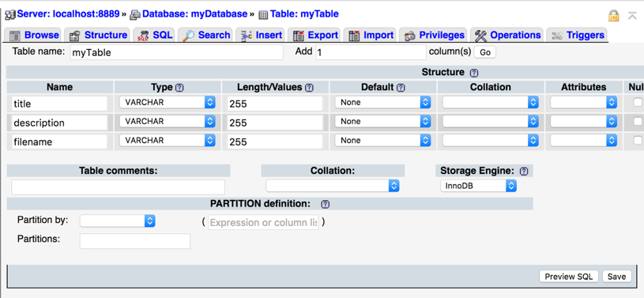

# Week Two - while(!asleep()) sheep++;

In order to complete this session, you will need to have completed the work from [week one](./week-one/).

Here are the instructions to follow for week two:

1. Open *MAMP* and start your servers.
2. From the MAMP Start Page http://localhost:8888/MAMP/ click on the *phpMyAdmin link*. phpMyAdmin lets us create and SQL code by using a GUI.
3. We’re going to create a database by clicking on the *Databases* tab.
4.	Underneath *Create Database* in *Database name* type `myDatabase`, (leave collation) and click on the *Create* button.
5.	Next, we’re going to create a table to go into our database:

  a.	If you’re not already on the *Structure* tab, click on it!

  b.	Underneath *Create Table* type `myTable` into *name*,

  c.	Type `3` in the number of columns, and

  d.	Click on *Go* to create the table.

6. The next screen enables us to define the names of our table columns and the data types we can keep in the table.  Let’s give our columns the following *names*:
  `title`, `description`, `filename` set the *(data-)types* to `VARCHAR` and the *lengths* to `255`. Click on the *Preview SQL* button and you can see the SQL code that will be run to generate a table based on the information you’ve just entered.  Close the preview and click on the *Save* button to run the SQL.

7. We’re going to add some data to the table using SQL:

  a. Click on the *SQL* tab,

  b. Click on the *INSERT* button,

  c. Type in the following:

        INSERT INTO `myTable` (`title`, `description`, `filename`) VALUES ('First title','This is a description of the first image','01.jpg');

  Notice how the quote marks used here are actually *grave accents* (AKA *backticks*).

  d. Click on the *Go* button.

8. If you click on the Browse tab, you can see the contents of your one row table. Let’s go back to the SQL tab and re-create the rest of the data that was in last weeks’ array of arrays:

        INSERT INTO `myTable` (`title`, `description`, `filename`) VALUES ('Second title', 'This is a description of the second image', '02.jpg');
        INSERT INTO `myTable` (`title`, `description`, `filename`) VALUES ('Third title', 'This is a description of the third image', '03.jpg');
        INSERT INTO `myTable` (`title`, `description`, `filename`) VALUES ('Fourth title', 'This is a description of the fourth image', '04.jpg');
        INSERT INTO `myTable` (`title`, `description`, `filename`) VALUES ('Fifth title', 'This is a description of the fifth image', '05.jpg');
        INSERT INTO `myTable` (`title`, `description`, `filename`) VALUES ('Sixth title', 'This is a description of the sixth image', '06.jpg');

9. We can use our PHP script to connect to the database, and loop through the data in the table but first we need to set up a database user:

  a.  Go to *Database: myDatabase* (in the breadcrumbs) and click on the *Privileges* tab;
  b.	Under *New*, click on *Add user account*;
  c.	Change *username* to: `myName`, *hostname* to: `localhost`, and add some passwords;
  d.	Under *Global privileges* check `Check all`;
  e.	And click the *Go* button to add your user.

10. We can use these credentials to connect our script to the database.  In your index.php file add the following to the top of your script (above the variables):

        $db = new mysqli('localhost', 'myName', 'myPassword', 'myDatabase');
        # check our connection to the database and return error if broken
        if($db->connect_errno > 0){
          die('Unable to connect to database [' . $db->connect_error . ']');
        }
11. When we open a connection to a database, it’s a good idea to close it afterwards – add this to the very end of index.php:

        <?php
          # close the connection to your database
          $db->close();
        ?>

12. Let’s go ahead and pull out all the rows of data in our table:

        # select all rows from the table myTable
        $sql = <<<SQL
        SELECT *
        FROM `myTable`
        SQL;

        # check our query will actually run
        if(!$result = $db->query($sql)){
          die('There was an error running the query [' . $db->error . ']');
        }

13. We now have a variable `$result` that contains a *mysqli_result object*, we can now loop through the result:

  a.	Delete the `$myArray` variable and the array of arrays we created last week,

  b.	Replace:

        for ($i = 0; $i < count($myArray); $i++ ) {
          $fileNumber = $i + 1;
          echo "<article class='6u 12u$(xsmall) work-item'>";
          echo "	";
          echo "	<h3>" . $myArray[$i][title] . "</h3>";
          echo "	
" . $myArray[$i][description] . "
";
          echo "</article>";
        }

    With:

        # loop through all the rows in the table
        while($row = $result->fetch_assoc()){
          echo "<article class='6u 12u$(xsmall) work-item'>";
          echo "	";
          echo "	<h3>" . $row['title'] . "</h3>";
          echo "	
" . $row['description'] . "
";
          echo "</article>";
        }
        # free up system resources
        $result->free();

## Ideas for expansion
* Show your profile image with your [Gravatar.com avatar](https://en.gravatar.com/site/implement/images/php/).
* Get the form to work [PHP Forms Tutorial](https://www.lynda.com/PHP-tutorials/Build-forms/587674/623963-4.html)!?
* Edit the CSS and the background image with something more personal?

## Next week:
We will replace our *two-dimensional array* with a *database table*.

## Further reading:
* [MySQL Data Types](https://dev.mysql.com/doc/refman/5.6/en/data-types.html) - what all the different *data-types* are.
* [Grave Accents](https://stackoverflow.com/questions/7857278/what-is-the-meaning-of-grave-accent-aka-backtick-quoted-characters-in-mysql) - why we use the grave accent to escape characters in MySQL.
